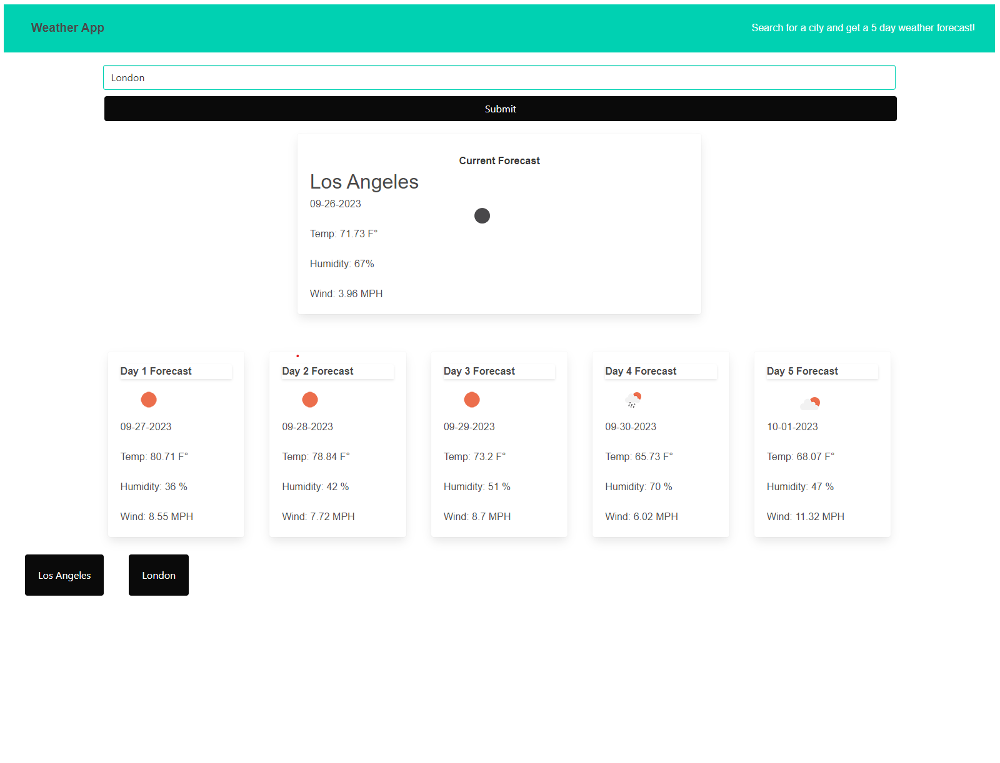

# 06 Weather App

## Description

This weather application will allow you to search any city and get a five day forecast including wind speed, temperature, and humidity. There will also be an icon that shows up representing the weather. Additionally every search is saved into a button so you can later access those cities' weather info. For this project I used the CSS framwork Bulma and actually found that I like it. Also I feel that this project really helped me lock in my API skills. I feel very comfortable calling APIs and displaying their data on my page.

## Installation

No need to install just run in browser. Link to deployed APP : https://n8hoang.github.io/06-challenge-weather

## Usage

Search a city and get a 5 day weather forecast. Each searched city will be saved as a button so you can later access that weather data at a later time.

## Credits

Coded by github.com/n8hoang

## License

MIT License

Copyright (c) [2023] [Nathan Hoang]

Permission is hereby granted, free of charge, to any person obtaining a copy
of this software and associated documentation files (the "Software"), to deal
in the Software without restriction, including without limitation the rights
to use, copy, modify, merge, publish, distribute, sublicense, and/or sell
copies of the Software, and to permit persons to whom the Software is
furnished to do so, subject to the following conditions:

The above copyright notice and this permission notice shall be included in all
copies or substantial portions of the Software.

THE SOFTWARE IS PROVIDED "AS IS", WITHOUT WARRANTY OF ANY KIND, EXPRESS OR
IMPLIED, INCLUDING BUT NOT LIMITED TO THE WARRANTIES OF MERCHANTABILITY,
FITNESS FOR A PARTICULAR PURPOSE AND NONINFRINGEMENT. IN NO EVENT SHALL THE
AUTHORS OR COPYRIGHT HOLDERS BE LIABLE FOR ANY CLAIM, DAMAGES OR OTHER
LIABILITY, WHETHER IN AN ACTION OF CONTRACT, TORT OR OTHERWISE, ARISING FROM,
OUT OF OR IN CONNECTION WITH THE SOFTWARE OR THE USE OR OTHER DEALINGS IN THE
SOFTWARE.
